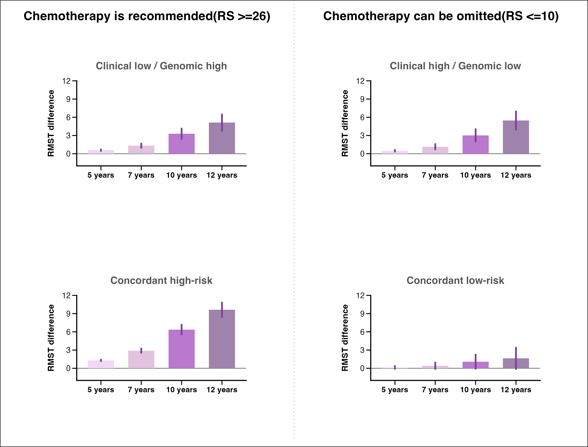

```{r}
# loading in packages
library(haven)
library(dplyr)
library(tidyr)
library(ggplot2)
library(survival)
library(cowplot)
library(grid)
library(survRM2)
```

```{r}
# loading in cleaned data
sas_file <- "/Users/stephkrieger/Desktop/clean.sas7bdat"

raw <- read_sas(
  sas_file,
  col_select = c(
    time,
    death,
    adjuvant_chemotherapy,
    RS_GROUP,
    score_group1
  )
)
```

```{r}
# figure number 1
# clean and recode variables
dat <- raw %>%
  transmute(
    time = as.numeric(time),
    death = as.integer(death),

    chemo = factor(
      as.integer(adjuvant_chemotherapy),
      levels = c(0, 1),
      labels = c("No chemotherapy", "Chemotherapy")
    ),

    genomic_risk = case_when(
      as.integer(RS_GROUP) == 1 ~ "Genomic low",
      as.integer(RS_GROUP) == 3 ~ "Genomic high",
      TRUE ~ NA_character_
    ),

    clinical_risk = case_when(
      as.integer(score_group1) == 0 ~ "Clinical low",
      as.integer(score_group1) == 1 ~ "Clinical high",
      TRUE ~ NA_character_
    ),

    panel = case_when(
      clinical_risk == "Clinical low" &
        genomic_risk == "Genomic high" ~ "Clinical low / Genomic high",

      clinical_risk == "Clinical high" &
        genomic_risk == "Genomic low" ~ "Clinical high / Genomic low",

      clinical_risk == "Clinical high" &
        genomic_risk == "Genomic high" ~ "Concordant high-risk",

      clinical_risk == "Clinical low" &
        genomic_risk == "Genomic low" ~ "Concordant low-risk",

      TRUE ~ NA_character_
    )
  ) %>%
  filter(
    !is.na(time),
    !is.na(death),
    !is.na(chemo),
    !is.na(panel)
  )
```

```{r}
# defining plot settings
panel_order <- c(
  "Clinical low / Genomic high",
  "Clinical high / Genomic low",
  "Concordant high-risk",
  "Concordant low-risk"
)

landmark_months <- c(60, 84, 120, 144)
landmark_labels <- c("5 years", "7 years", "10 years", "12 years")

curve_cols <- c(
  "No chemotherapy" = "#ff3030",
  "Chemotherapy" = "#1f77b4"
)
```

```{r}
# helper functions
format_p <- function(p) {
  if (is.na(p)) return("log-rank p=NA")
  if (p < 0.0001) return("log-rank p<.0001")
  paste0("log-rank p=", sub("^0", "", sprintf("%.4f", p)))
}

surv_at_landmarks <- function(fit) {
  s <- summary(fit, times = landmark_months, extend = TRUE)

  tibble(
    chemo = sub("^chemo=", "", s$strata),
    month = s$time,
    survival = sprintf("%.2f", 100 * s$surv)
  )
}

km_data <- function(fit) {
  s <- summary(fit)

  tibble(
    time = s$time,
    surv = s$surv,
    n_censor = s$n.censor,
    chemo = sub("^chemo=", "", s$strata)
  )
}
```

```{r}
# making one panel
make_panel <- function(panel_name) {
  d <- dat %>% filter(panel == panel_name)

  fit <- survfit(Surv(time, death) ~ chemo, data = d)

  lr <- survdiff(Surv(time, death) ~ chemo, data = d)
  p_value <- pchisq(lr$chisq, length(lr$n) - 1, lower.tail = FALSE)

  curves <- km_data(fit)
  censors <- curves %>% filter(n_censor > 0)
  surv_tbl <- surv_at_landmarks(fit)

  counts <- d %>%
    count(chemo, name = "n") %>%
    complete(chemo = levels(dat$chemo), fill = list(n = 0)) %>%
    mutate(chemo = factor(chemo, levels = levels(dat$chemo))) %>%
    arrange(chemo) %>%
    mutate(
      pct = n / sum(n),
      xmax = 35 + cumsum(pct) * 90,
      xmin = lag(xmax, default = 35)
    )

  label_no <- counts %>%
    filter(chemo == "No chemotherapy") %>%
    transmute(label = sprintf("No chemo:%.2f%%  %s", 100 * pct, n)) %>%
    pull(label)

  label_yes <- counts %>%
    filter(chemo == "Chemotherapy") %>%
    transmute(label = sprintf("Chemo:%.2f%%  %s", 100 * pct, n)) %>%
    pull(label)

  ggplot(curves, aes(time, surv, color = chemo)) +
    geom_step(linewidth = 0.75) +
    geom_point(
      data = censors,
      aes(time, surv, color = chemo),
      shape = 3,
      size = 1.1,
      stroke = 0.45,
      show.legend = FALSE
    ) +
    geom_rect(
      data = counts,
      aes(xmin = xmin, xmax = xmax, ymin = 0.485, ymax = 0.555, fill = chemo),
      inherit.aes = FALSE,
      color = NA
    ) +
    annotate("text", x = 64, y = 0.465, label = label_no, size = 2.05, fontface = "bold") +
    annotate("text", x = 112, y = 0.465, label = label_yes, size = 2.05, fontface = "bold") +
    annotate("text", x = landmark_months, y = 0.325, label = landmark_labels, size = 2.35, fontface = "bold") +
    annotate("text", x = 6, y = 0.25, label = "No chemo", hjust = 0, size = 2.25, fontface = "bold") +
    annotate("text", x = 6, y = 0.19, label = "Chemo", hjust = 0, size = 2.25, fontface = "bold") +
    annotate(
      "text",
      x = landmark_months,
      y = 0.25,
      label = surv_tbl %>% filter(chemo == "No chemotherapy") %>% pull(survival),
      size = 2.25,
      fontface = "bold"
    ) +
    annotate(
      "text",
      x = landmark_months,
      y = 0.19,
      label = surv_tbl %>% filter(chemo == "Chemotherapy") %>% pull(survival),
      size = 2.25,
      fontface = "bold"
    ) +
    annotate(
      "label",
      x = 28,
      y = 0.025,
      label = format_p(p_value),
      label.padding = unit(0.08, "lines"),
      size = 2.35,
      fontface = "bold",
      fill = "white"
    ) +
    scale_color_manual(values = curve_cols, name = NULL) +
    scale_fill_manual(values = curve_cols, name = NULL) +
    scale_x_continuous(
      "TIME(Month)",
      limits = c(0, 170),
      breaks = c(0, 50, 100, 150),
      expand = c(0, 0)
    ) +
    scale_y_continuous(
      "Survival probability",
      limits = c(0, 1.02),
      breaks = seq(0, 1, 0.1),
      expand = c(0, 0)
    ) +
    labs(title = panel_name) +
    guides(fill = "none") +
    theme_classic(base_size = 8) +
    theme(
      plot.title = element_text(hjust = 0.5, face = "bold", size = 11, color = "#555555"),
      axis.title = element_text(face = "bold", size = 8),
      axis.text = element_text(size = 7, color = "black"),
      legend.position = c(0.78, 0.06),
      legend.background = element_rect(fill = "white", color = "#888888", linewidth = 0.25),
      legend.key.height = unit(0.11, "in"),
      legend.key.width = unit(0.32, "in"),
      legend.text = element_text(size = 7, face = "bold"),
      panel.border = element_rect(color = "#bdbdbd", fill = NA, linewidth = 0.35),
      plot.margin = margin(7, 10, 6, 10)
    )
}
```

```{r}
# creating four panels
p1 <- make_panel(panel_order[1])
p2 <- make_panel(panel_order[2])
p3 <- make_panel(panel_order[3])
p4 <- make_panel(panel_order[4])
```

```{r}
# combining into one figure
#| label: fig-km-combined
#| fig-width: 12
#| fig-height: 9
#| out-width: "100%"
#| fig-align: center

combined <- ggdraw() +
  draw_plot(p1, x = 0.04, y = 0.54, width = 0.44, height = 0.37) +
  draw_plot(p2, x = 0.54, y = 0.54, width = 0.44, height = 0.37) +
  draw_plot(p3, x = 0.04, y = 0.08, width = 0.44, height = 0.37) +
  draw_plot(p4, x = 0.54, y = 0.08, width = 0.44, height = 0.37) +
  draw_label(
    "Chemotherapy is recommended (RS >=26)",
    x = 0.25,
    y = 0.965,
    fontface = "bold",
    size = 12
  ) +
  draw_label(
    "Chemotherapy can be omitted (RS <=10)",
    x = 0.75,
    y = 0.965,
    fontface = "bold",
    size = 12
  ) +
  draw_line(
    c(0.5, 0.5),
    c(0.02, 1.0),
    color = "#bdbdbd",
    linetype = "dotted",
    linewidth = 0.35
  ) +
  draw_line(c(0.0, 1.0), c(0.0, 0.0), color = "#333333", linewidth = 0.6) +
  draw_line(c(0.0, 1.0), c(1.0, 1.0), color = "#333333", linewidth = 0.6) +
  draw_line(c(0.0, 0.0), c(0.0, 1.0), color = "#333333", linewidth = 0.6) +
  draw_line(c(1.0, 1.0), c(0.0, 1.0), color = "#333333", linewidth = 0.6)

combined
```
```{r}
# figure number 2
# recode data 

dat <- raw %>%
  transmute(
    time = as.numeric(time),
    death = as.integer(death),

    chemo = as.integer(adjuvant_chemotherapy),

    chemo_label = factor(
      chemo,
      levels = c(0, 1),
      labels = c("No chemotherapy", "Chemotherapy")
    ),

    genomic_risk = case_when(
      as.integer(RS_GROUP) == 1 ~ "Genomic low",
      as.integer(RS_GROUP) == 3 ~ "Genomic high",
      TRUE ~ NA_character_
    ),

    clinical_risk = case_when(
      as.integer(score_group1) == 0 ~ "Clinical low",
      as.integer(score_group1) == 1 ~ "Clinical high",
      TRUE ~ NA_character_
    ),

    panel = case_when(
      clinical_risk == "Clinical low" &
        genomic_risk == "Genomic high" ~ "Clinical low / Genomic high",

      clinical_risk == "Clinical high" &
        genomic_risk == "Genomic low" ~ "Clinical high / Genomic low",

      clinical_risk == "Clinical high" &
        genomic_risk == "Genomic high" ~ "Concordant high-risk",

      clinical_risk == "Clinical low" &
        genomic_risk == "Genomic low" ~ "Concordant low-risk",

      TRUE ~ NA_character_
    )
  ) %>%
  filter(
    !is.na(time),
    !is.na(death),
    !is.na(chemo),
    !is.na(panel)
  )
```

```{r}
# Defining panel order, time points, and colors
panel_order <- c(
  "Clinical low / Genomic high",
  "Clinical high / Genomic low",
  "Concordant high-risk",
  "Concordant low-risk"
)

landmark_months <- c(60, 84, 120, 144)
landmark_labels <- c("5 years", "7 years", "10 years", "12 years")

bar_cols <- c(
  "5 years" = "#f0d8f6",
  "7 years" = "#e1c3df",
  "10 years" = "#b979cf",
  "12 years" = "#9f83ad"
)
```

```{r}
# calculate differences
get_rmst_difference <- function(data, tau_months, label) {
  fit <- rmst2(
    time = data$time,
    status = data$death,
    arm = data$chemo,
    tau = tau_months
  )

  rmst_row <- fit$unadjusted.result[
    grep("RMST.*arm=1.*arm=0", rownames(fit$unadjusted.result)),
    ,
    drop = FALSE
  ]

  tibble(
    months = tau_months,
    years = label,
    rmst_diff = as.numeric(rmst_row[1, "Est."]),
    lower = as.numeric(rmst_row[1, "lower .95"]),
    upper = as.numeric(rmst_row[1, "upper .95"])
  )
}

rmst_results <- bind_rows(
  lapply(panel_order, function(panel_name) {
    d_panel <- dat %>% filter(panel == panel_name)

    bind_rows(
      Map(
        function(tau, label) {
          get_rmst_difference(d_panel, tau, label)
        },
        landmark_months,
        landmark_labels
      )
    ) %>%
      mutate(panel = panel_name)
  })
)

rmst_results
```

```{r}
# create plot function for one panel
make_rmst_panel <- function(panel_name) {
  plot_data <- rmst_results %>%
    filter(panel == panel_name) %>%
    mutate(
      years = factor(years, levels = landmark_labels)
    )

  ggplot(plot_data, aes(x = years, y = rmst_diff, fill = years)) +
    geom_hline(yintercept = 0, color = "#8a8a8a", linewidth = 0.55) +
    geom_col(width = 0.65, color = NA) +
    geom_errorbar(
      aes(ymin = lower, ymax = upper),
      width = 0,
      linewidth = 1.05,
      color = "#7b3f98"
    ) +
    scale_fill_manual(values = bar_cols, guide = "none") +
    scale_y_continuous(
      "RMST difference",
      limits = c(-2, 12),
      breaks = c(0, 3, 6, 9, 12),
      expand = c(0, 0)
    ) +
    scale_x_discrete(NULL) +
    labs(title = panel_name) +
    theme_classic(base_size = 11) +
    theme(
      plot.title = element_text(
        hjust = 0.5,
        face = "bold",
        size = 13,
        color = "#555555",
        margin = margin(b = 12)
      ),
      axis.title.y = element_text(face = "bold", size = 11, margin = margin(r = 8)),
      axis.text.x = element_text(face = "bold", size = 10, color = "black"),
      axis.text.y = element_text(size = 10, color = "black"),
      axis.line = element_line(color = "black", linewidth = 0.65),
      axis.ticks = element_line(color = "black", linewidth = 0.55),
      axis.ticks.length = unit(0.08, "in"),
      plot.margin = margin(8, 20, 8, 20)
    )
}
```

```{r}
# make the four panels
p1 <- make_rmst_panel(panel_order[1])
p2 <- make_rmst_panel(panel_order[2])
p3 <- make_rmst_panel(panel_order[3])
p4 <- make_rmst_panel(panel_order[4])
```

```{r}
# combine panels
#| out-width: "100%"
#| fig-align: center

combined_rmst <- ggdraw() +
  draw_plot(p1, x = 0.055, y = 0.585, width = 0.39, height = 0.29) +
  draw_plot(p2, x = 0.555, y = 0.585, width = 0.39, height = 0.29) +
  draw_plot(p3, x = 0.055, y = 0.105, width = 0.39, height = 0.29) +
  draw_plot(p4, x = 0.555, y = 0.105, width = 0.39, height = 0.29) +
  draw_label(
    "Chemotherapy is recommended(RS >=26)",
    x = 0.25,
    y = 0.965,
    fontface = "bold",
    size = 16
  ) +
  draw_label(
    "Chemotherapy can be omitted(RS <=10)",
    x = 0.75,
    y = 0.965,
    fontface = "bold",
    size = 16
  ) +
  draw_line(
    c(0.5, 0.5),
    c(0.02, 1.0),
    color = "#c7c7c7",
    linetype = "dotted",
    linewidth = 0.55
  ) +
  draw_line(c(0, 1), c(0, 0), color = "#333333", linewidth = 0.7) +
  draw_line(c(0, 1), c(1, 1), color = "#333333", linewidth = 0.7) +
  draw_line(c(0, 0), c(0, 1), color = "#333333", linewidth = 0.7) +
  draw_line(c(1, 1), c(0, 1), color = "#333333", linewidth = 0.7)

ggsave(
  filename = "recreated_rmst_graph.png",
  plot = combined_rmst,
  width = 10.5,
  height = 8.0,
  dpi = 300,
  bg = "white"
)


```


